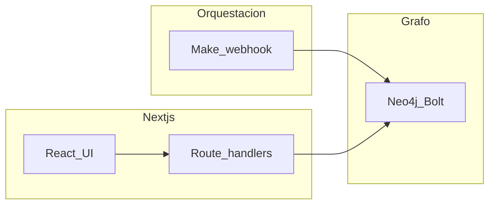

# Q Threats

[](LICENSE)
[](https://q-threats.vercel.app)

> Plataforma web para **gobernanza transparente** en Guatemala: conecta **compras públicas**, **actores políticos**, **iniciativas normativas** y **redes de relaciones** en una sola experiencia visual.

**Contexto:** proyecto orientado a **hackathon** (track transparencia y anticorrupción): prioriza claridad de propuesta, **deploy público**, código **open source** y documentación reproducible.

**Deploy en producción:** [https://q-threats.vercel.app](https://q-threats.vercel.app)

---

## Pitch en 30 segundos

La herramienta de asistencia para transparencia usa una **estructura basada en grafos** para conectar nodos (por ejemplo **diputados**, **entidades**, relaciones de tipo **RELACION** u homólogas según el origen de los datos) y **generar relaciones** entre actores y hechos públicos. El propósito es identificar **vínculos** que ayuden a descubrir **patrones**, **conexiones** y **riesgos** en la información analizada—como apoyo a periodistas, auditores y ciudadanía, **no** como veredicto legal.

**En producción**, el flujo puede incluir **Make** (webhook) para recolectar y transformar información hacia **Neo4j** (p. ej. **Aura** u otro endpoint `bolt`/`neo4j`). Esta app **lee** ese grafo vía API y lo muestra en **Relations**; el chat y herramientas MCP pueden consumir el mismo backend. **Advertencia:** el repositorio incluye **datos de demostración** en `lib/data.ts`. Sin Neo4j ni integraciones configuradas, gran parte de la UI sigue funcionando con ese demo; el grafo “en vivo” y la legislatura vía Make dependen de variables de entorno.

---

## Problema que aborda

- La información sobre **adquisiciones**, **iniciativas** y **actores** está dispersa y es difícil de **enlazar** (personas, instituciones, relaciones declaradas o inferidas).
- Ciudadanía y medios necesitan **contexto estructural** (quién con quién, qué sector toca, qué riesgos se señalan), no solo listados.

## Enfoque (cómo lo resuelve)

1. **Sectores y casos** — amenazas / análisis por id (demo) o iniciativas (cuando Make responde).
2. **Proponentes y actores** — diputados ponentes, entidades, nodos de conflicto donde el modelo de datos lo permite.
3. **Relaciones** — grafo 2D (Neo4j) y vistas de análisis 3D / red según la pantalla.
4. **Riesgos y fuentes** — paneles con resúmenes; **chat** con *grounding* en un paquete de contexto (amenazas + snapshot de grafo cuando aplica).
5. **API HTTP + MCP** — datos expuestos para integraciones y agentes sin exponer credenciales de base de datos en el cliente.

---

## Recolección y procesamiento (Make → Neo4j)

Un flujo en **Make** puede actuar como intermediario: webhooks, transformación a JSON y escritura en **Neo4j**. Eso reduce trabajo manual y mantiene el grafo alimentado para la app.

| Paso | Rol |
|------|-----|
| Entrada | Webhook u orígenes conectados en Make |
| Procesamiento | Limpieza, enriquecimiento, llamadas a servicios externos |
| Salida | JSON estandarizado hacia el conector de grafo |
| Persistencia | Neo4j (nodos y relaciones; p. ej. Aura en la nube) |

**Diagrama del escenario** (añade la imagen al repo antes de presentar si aún no está):


*Si el archivo no existe todavía: guarda tu captura o export como `docs/make-flow.png` en la raíz del proyecto.*

---

## Qué incluye la aplicación (rutas)

| Ruta | Descripción |
|------|-------------|
| **`/`** (Threats) | Mapa de Guatemala por departamento, listado de amenazas (**demo** en `lib/data.ts`). Abre **análisis 3D** por amenaza. Búsqueda de **iniciativa** vía Make cuando `MAKE_*` está configurado. |
| **`/relations`** | Grafo 2D interactivo desde **`GET /api/graph`** (**solo Neo4j**). Sin credenciales, error `503`. Búsqueda, expansión a vecinos, panel de nodo, accesibilidad por teclado. |
| **`/chat`** | Asistente: el servidor inyecta contexto desde `buildChatContextPack` (Neo4j si está configurado y responde; si no, **snapshot demo**). Requiere **MiniMax** en el servidor para respuestas reales. |
| **`/api-reference`** | Guía HTTP: URL base, **CORS**, tabla de endpoints, ejemplos `curl`. |
| **`/docs`** | Guía técnica corta y enlaces útiles. |
| **`/mcp`** | Cómo conectar **Cursor** (u otro cliente) al servidor MCP **stdio** que llama al backend por HTTP. |

### Deep links (compartir análisis)

Parámetros en la página principal (ver `lib/analysisUrl.ts`):

- `?amenaza=<threatId>` — abre análisis demo por id (ej. `t1`).
- `?iniciativa=<id>` — dispara **búsqueda legislativa** (Make → análisis).

---

## Arquitectura



**Opcional:** **Supabase** alimenta `GET /api/recent-reports` (tabla `law_risk_reports`) cuando `SUPABASE_*` está definido.

---

## Stack tecnológico

| Capa | Tecnología |
|------|------------|
| Framework | **Next.js 15** (App Router), **React 19**, **TypeScript** |
| Estilo | **Tailwind CSS 4**, utilidades “glass / liquid glass” (`app/globals.css`) |
| 3D | **Three.js**, **@react-three/fiber**, **@react-three/drei** |
| Grafo 2D | **d3-force**, **d3-zoom**, **d3-selection** |
| Grafo en servidor | **Neo4j** vía **neo4j-driver** |
| Datos demo | `lib/data.ts` |
| Legislativo | **Make** (webhook HTTP desde `lib/make/`) |
| Reportes recientes | **Supabase** (`@supabase/supabase-js`) |
| Chat | **MiniMax** API (clave solo en servidor) |
| MCP local | **@modelcontextprotocol/sdk**, **tsx**, **zod**, **dotenv** (`mcp/server.ts`) |
| CORS | **middleware** Next en `/api/*` |

---

## Requisitos

- **Node.js** LTS (compatible con Next 15).
- **npm**.

---

## Puesta en marcha (local)

```bash
npm install
npm run dev
```

Abre **http://localhost:3000** (puerto 3000).

- **Threats** y análisis **demo** funcionan **sin** Neo4j.
- **`/relations`** necesita Neo4j (**503** si falta configuración).
- **Chat** necesita `MINIMAX_API_KEY` para obtener respuestas del modelo.
- **Iniciativas** via Make necesitan `MAKE_WEBHOOK_URL` y `MAKE_API_KEY`.

Copia **`.env.example`** a **`.env.local`** y completa según las integraciones que uses. **No subas** `.env.local` al repositorio.

### Documentación estática (Docsify)

El repo incluye un sitio **Docsify** en la carpeta [`docs/`](docs/) (`index.html` + Markdown). Para previsualizarlo en local (puerto **3001** por defecto, distinto de Next):

```bash
npm run docs:dev
```

Útil para GitHub Pages (rama o carpeta `docs/`) o cualquier hosting estático sirviendo `docs/` con `index.html` como entrada.

---

## Variables de entorno (referencia)

| Área | Variables | Notas |
|------|-----------|--------|
| **Neo4j** | `NEO4J_URI` (también se aceptan alias listados en `lib/neo4j/config.ts`), `NEO4J_USER` o `NEO4J_USERNAME`, `NEO4J_PASSWORD` o `NEO4J_SECRET` | Obligatorias para `/api/graph` y para leer el grafo en chat/MCP snapshot cuando no hay fallback. |
| | `NEO4J_DATABASE`, `NEO4J_REL_LIMIT`, `NEO4J_CYPHER` | Opcionales (Aura/Enterprise, límite de aristas, Cypher custom). |
| | `NEO4J_ACQUISITION_TITLE`, `NEO4J_ACQUISITION_SUMMARY`, `NEO4J_ACQUISITION_LINK`, `NEO4J_ACQUISITION_INSTITUTION`, `NEO4J_ACQUISITION_AMOUNT`, `NEO4J_ACQUISITION_DATE` | Metadatos sintéticos del nodo “adquisición” en la proyección del grafo. |
| **Make** | `MAKE_WEBHOOK_URL`, `MAKE_API_KEY` | Webhook que recibe `{ iniciativa_id }` y devuelve payload mapeable a `ThreatAnalysis`. |
| **Supabase** | `SUPABASE_URL`, `SUPABASE_SERVICE_ROLE_KEY` o `SUPABASE_SECRET_KEY` o `SUPABASE_ANON_KEY` | Si faltan, `GET /api/recent-reports` responde **503**. |
| **Chat (MiniMax)** | `MINIMAX_API_KEY`, `MINIMAX_BASE_URL`, `MINIMAX_MODEL` | La clave es obligatoria para `/api/chat`; base URL y modelo tienen defaults en código. |
| **MCP (solo proceso local)** | `Q_THREATS_BACKEND_URL` | Base del backend (p. ej. `http://127.0.0.1:3000` o el deploy). Default local si se omite. |

Detalle comentado: **`.env.example`**.

---

## Scripts npm

| Script | Uso |
|--------|-----|
| `npm run dev` | Desarrollo en **http://localhost:3000**. |
| `npm run dev:clean` | Limpia caché (`.next`, etc.) y arranca dev. |
| `npm run build` / `npm start` | Producción. |
| `npm run lint` | Typecheck (`tsc --noEmit`). |
| `npm run clean` | Elimina `.next` y caché de herramientas. |
| `npm run generate:departments` | Regenera SVG de departamentos → `public/departments/`. |
| `npm run mcp:stdio` | Servidor MCP (stdio) que llama al backend HTTP; ver `/mcp`. |
| `npm run docs:dev` | Docsify: documentación en `docs/` (puerto 3001). |

---

## API REST (resumen)

- **Documentación en la app:** [https://q-threats.vercel.app/api-reference](https://q-threats.vercel.app/api-reference) (o `/api-reference` en local).
- **Preflight / CORS:** rutas bajo `/api/*` exponen cabeceras permisivas y responden **OPTIONS** (`middleware.ts`).
- **Patrones de respuesta:** suele ser `{ data: ... }`, `{ error: string }`, o cuerpos específicos (`/api/mcp/context-pack` → `{ text }`, `/api/chat` → `{ reply }`).

| Método | Ruta | Rol breve |
|--------|------|-----------|
| GET | `/api/threats` | Amenazas; query `q`, `level`, `limit`. |
| GET | `/api/nodes` | Nodos; query opcional `ids`. |
| GET | `/api/departments` | Departamentos (Guatemala). |
| GET | `/api/analysis/[threatId]` | Análisis demo por amenaza. |
| GET | `/api/legislation/[id]` | Análisis por iniciativa (Make). |
| GET | `/api/recent-reports` | Reportes recientes (Supabase). |
| GET | `/api/graph` | **Solo Neo4j**; sin env → **503**. `?check=1` diagnostica configuración. |
| GET | `/api/mcp/graph-snapshot` | Grafo para integraciones: Neo4j en servidor **o** fallback demo. |
| GET | `/api/mcp/context-pack` | Texto para contexto de modelos. |
| POST | `/api/chat` | Chat MiniMax; cuerpo `{ messages: [{ role, content }] }`. |

---

## MCP (Model Context Protocol)

El proceso `npm run mcp:stdio` ejecuta `mcp/server.ts`: herramientas que **solo** llaman al backend por HTTP (sin credenciales Neo4j en el cliente MCP). Configura **`Q_THREATS_BACKEND_URL`** apuntando al deploy o a `http://127.0.0.1:3000`. Instrucciones en la ruta **`/mcp`** de la app.

---

## Estructura útil del repositorio

```text
app/                  # Páginas: /, /relations, /chat, /docs, /api-reference, /mcp
app/api/              # Route Handlers REST
components/           # UI (HomePage, RelationsForceGraph, AnalysisNetworkView, nav…)
lib/
  data.ts             # Demo: amenazas y análisis
  types.ts            # Contratos TypeScript
  neo4j/              # Cliente y fetch del grafo
  make/               # Integración webhook Make → ThreatAnalysis
  supabase/           # Cliente servidor para reportes
  chat/               # Paquete de contexto para el chat
  mcp/                # Snapshot de grafo compartido con API MCP
mcp/server.ts         # Servidor MCP stdio (desarrollo / Cursor)
middleware.ts         # CORS para /api/*
docs/                 # Docsify (index.html, *.md) — npm run docs:dev
public/               # Activos estáticos (departamentos SVG, logos)
scripts/              # Utilidades (p. ej. generate-department-paths.mjs)
```

Diseño UI: **`DESIGN.md`**. Guía para contribuir / convenciones: **`AGENTS.md`**.

---

## Datos, metodología y limitaciones

- **Demo (`lib/data.ts`):** permite probar UX y flujos sin infraestructura; no sustituye auditoría sobre datos reales.
- **Neo4j / Make / Supabase:** cuando están configurados, la app refleja **tu** pipeline y políticas de calidad de datos; documenta en el hackathon qué fuentes alimentan Make y el grafo.
- **Chat:** el modelo recibe un contexto acotado; las respuestas son **asistencia** basada en ese contexto, no conclusiones judiciales ni investigación cerrada.

---

## Demo y presentación (hackathon)

- **Deploy:** [https://q-threats.vercel.app](https://q-threats.vercel.app)
- **Video demo (2–3 min):** _(completar URL)_
- **Slides / Figma:** _(completar URL)_

**Guión sugerido:** inicio (mapa + amenazas) → análisis 3D → búsqueda o deep link de iniciativa → `/relations` (Neo4j) con vecinos → `/chat` opcional → mencionar **API** y **open source**.

---

## Próximos pasos (ideas)

- Más fuentes públicas verificables enlazadas a nodos y aristas.
- Roles (periodista / auditoría) y exportación de subgrafos o reportes.
- Pruebas automatizadas sobre mapeos Make → `ThreatAnalysis`.

---

## Licencia

Este proyecto se distribuye bajo la **GNU Affero General Public License v3.0**. Ver el archivo [`LICENSE`](LICENSE).

Si modificas el código y **pones en red** un servicio que use esa versión, AGPL exige que los usuarios de la red puedan obtener el **código fuente** correspondiente. Para detalle legal, lee el texto completo de la licencia.

---

## Créditos

- **Hackathon / evento:** _(completar nombre del evento)_  
- **Equipo:** _(completar nombres o enlaces)_  
